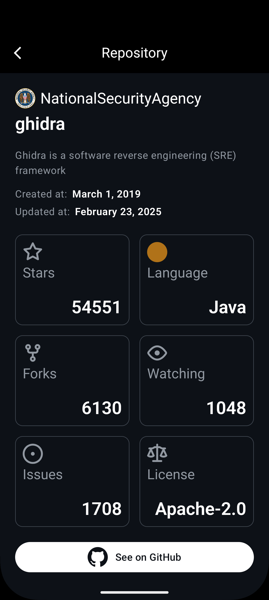

<h1 align="center"><b>GitHubTrends</b></h1>

*GitHubTrends* is an Android application that displays a list of trending projects from GitHub, allows users to tap on one of them, and displays their details.

## Screenshots

  
     
     

